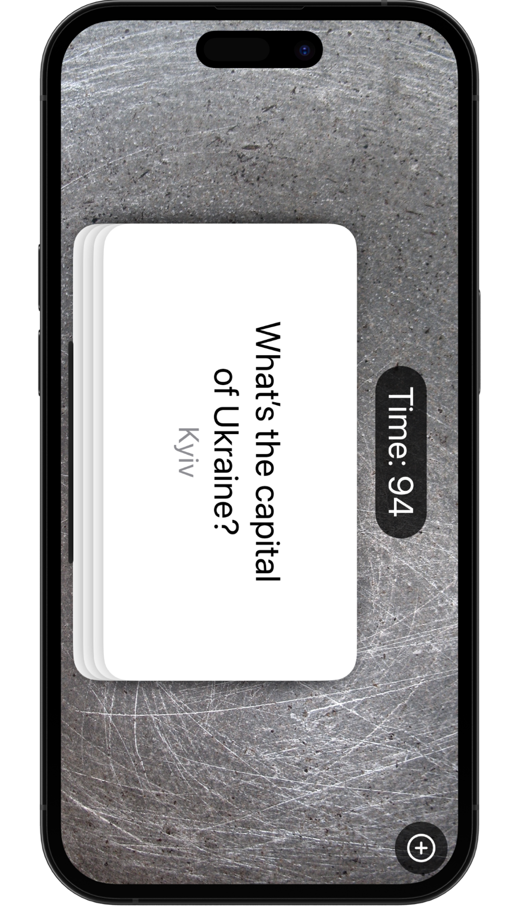
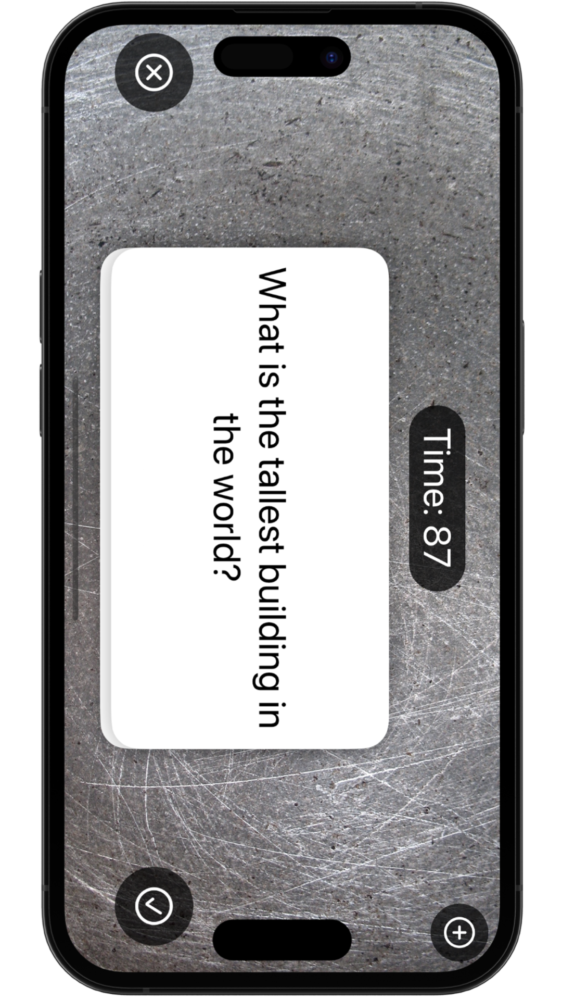
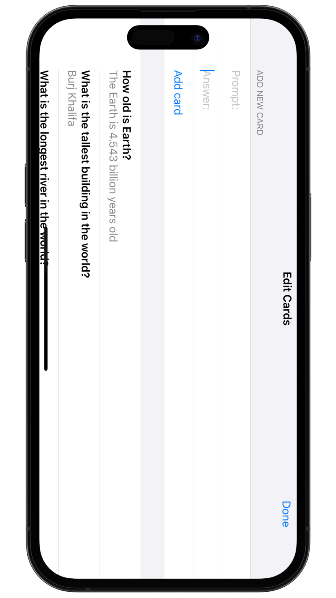

# &nbsp; 📑 Flashzilla 

### Project 17
##### Author: *[MatviiArtemenko](https://github.com/100DaysOfSwiftUI-MatviiArtemenko)*

##### 100DaysOfSwiftUI form *[@twostraws](https://twitter.com/twostraws "twostraws twitter page")*

##### Follow along: *[100DaysOfSwiftUI](https://www.hackingwithswift.com/100/swiftui "Hacking with Swift")*

---

> *This was our another super-sized project, but also another one where we covered some really great techniques like gestures, haptics, `Combine`, and more. When these features work together we can do remarkable things in our apps, providing an experience to users that is seamless and delightful. You also saw once again the importance of ensuring accessibility in our apps. It’s easy to get carried away with cool gestures and more, but then forget that straying from standard UI also means we need to up our game when it comes to VoiceOver and more.*

---

## &nbsp; 📚 Covered topics

Combine, Accessability, FileManager, Gestures, Haptic

---
## &nbsp; 🎖 Challenge
* [x] When adding a card, the textfields keep their current text – fix that so that the textfields clear themselves after a card is added..

* [x] If you drag a card to the right but not far enough to remove it, then release, you see it turn red as it slides back to the center. Why does this happen and how can you fix it?

* [x] For a harder challenge: when the users gets an answer wrong, add that card goes back into the array so the user can try it again. Doing this successfully means rethinking the ForEach loop, because relying on simple integers isn’t enough – your cards need to be uniquely identifiable.

 

---
## &nbsp; 📲 Screenshoot

  
  
  

---
##  &nbsp; 🔍 &nbsp; Resources 

* [Apple documentation - accessibility](https://developer.apple.com/accessibility/)

